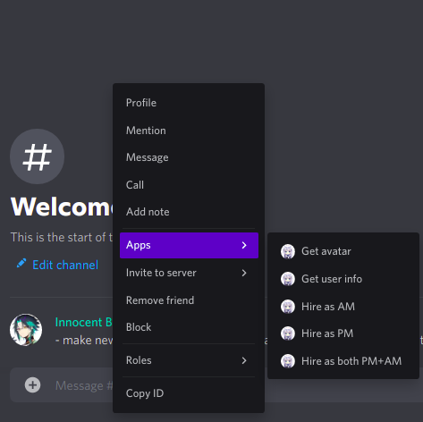

# Context Menus

## What is context menu?

Context menu commands is kind of command where you can execute from right-click menu. Currently context menu only available on desktop client of discord. See picture below for example of context menu.

## Available Context Menus

### Get Avatar

Get target user's avatar. Refer [here](utilities.md#get-users-avatar) for more details.

### Get User Info

Get target user's information. Refer [here](utilities.md#get-users-info) for more details.

### Hire as PM

Hire target user as PM. Refer [here](partnership.md#add-managers) for more details.

### Hire as AM

Hire target user as AM. Refer [here](partnership.md#add-managers) for more details.

### Hire as both PM+AM

Hire target user as both PM and AM. Refer [here](partnership.md#add-managers) for more details.