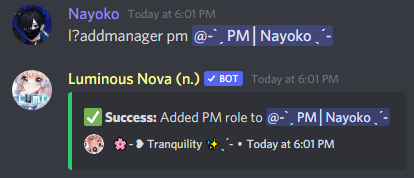

# Hiring PMs & AMs with one command

This tutorial will guide you through setting up an automated process that automatically gives a desired user the appropriate PM or AM role, as well as a customizable way to automatically change their name to include *PM* or *AM* in it.

> [!IMPORTANT] 
> Nova requires the ***Manage Roles*** and ***Manage Nicknames*** permissions for this feature.

> [!NOTE] 
> Make sure Nova's role is above the **PM** and **AM** roles! **Nova can not give users a role higher than its own!**

1. First, we need to tell Nova which roles are for **PM** and **AM**. We can set our PM role by using `[prefix]setpmrole @role` and our AM role by using `[prefix]setamrole @role`.

> [!NOTE] 
> Steps two & three can be skipped if you don't want Nova to change the nicknames of PMs & AMs you add.

2. Then, we can set the nickname system we want our PMs & AMs to use. We can also use **variables** in our nickname formats (which we gave an overview of [here](https://github.com/Naiyoko/nova-markdown/blob/master/tutorials/custom_reply.md) in **step 4**.) The format is `[prefix]setnick am`/`pm`/`both NickFormatHere`.

3. So, let's set our PM nickname as an example. I'm going to run `[prefix]setnick pm ─꒰PM | $(user.nick) ˎˊ-`, which tells Nova to set their name to `─꒰PM | ˎˊ-` and place their name in the middle, after the `|` symbol. Example:

It is the same process for `[prefix]setnickformat am`. You can customize the aesthetics to your liking.

4. Now, when we add a manager using Nova, everything we've set up will take place. We can add a manager with Nova using `[prefix]addmanager am`/`pm UserID`/`@user`. Example:

> [!WARNING] 
> The `/` indicates instructions to use **one or the other** in your command, **not both**.

5. Lastly, you can remove managers using `[prefix]removemanager UserID`/`@user`, and get a list of all managers using `[prefix]listmanager am`/`pm`.

> ***If you have any issues following this tutorial, you can check our [FAQ](../faq.md), or join our [support server](https://discord.gg/cAKmRVrsjR) for help.***