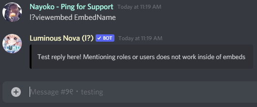
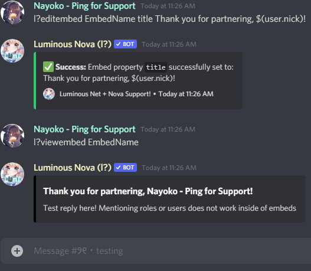
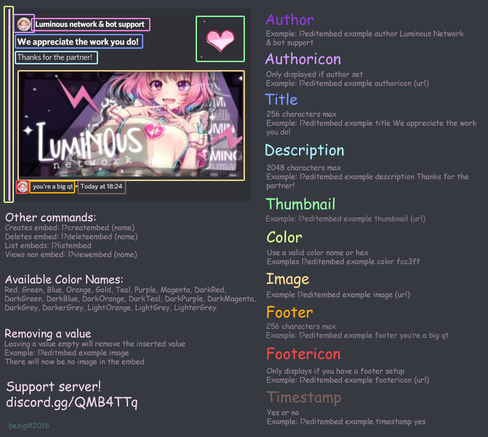

# Customizing your partnership & affiliate responses / How to make an embed

This tutorial will show you how to customize each aspect of Nova's partnership and affiliate replies. Add the server prefix to the beginning of each command in this tutorial.

1. First, create an embed. You can create one using `[prefix]createembed EmbedName`. Note that your embed name will be **case-sensitive**.

2. Now that you have your embed created, we can start editing it. We edit it by using `[prefix]editembed EmbedName [element] [value]`. `element` is where we will decide what part of the embed to edit, and `value` is what we want to edit it to. Here's the list of valid elements and accepted values of the embed:

Element | Accepted value
---|---
`author` | 256 characters string.
`authoricon` | HTTPS-only image URL. Only displayed if author set.
`title` | 256 characters string.
`description` | 2048 characters string.
`thumbnail` | Image URL.
`color` | Valid color name or color hex. Available color names: `Red`, `Green`, `Blue`, `Orange`, `Gold`, `Teal`, `Purple`, `Magenta`, `DarkRed`, `DarkGreen`, `DarkBlue`, `DarkOrange`, `DarkTeal`, `DarkPurple`, `DarkMagenta`, `DarkGrey`, `DarkerGrey`, `LightOrange`, `LightGrey`, `LighterGrey`.
`image` | Image URL.
`footer` | 256 characters string.
`footericon` | HTTPS-only image URL. Only displayed if footer set.
`timestamp` | `Yes` or `No` value.

> [!NOTE]
> You can also run `[prefix]help editembed` to see all available elements for embed.

3. So let's edit one as an example. Run `[prefix]editembed EmbedName description Test reply here! Mentioning roles or users does not work inside of embeds`. As you can see, when we run `[prefix]viewembed EmbedName`, we can see the description we just edited:

4. Let's do one more, to give you an example on how to use what are called **variables**. Variables are exactly what the word describes - they change, depending on, well, variables. For example, let's edit the description again. Let's run `[prefix]editembed EmbedName title Thank you for partnering, $(user.nick)!`. What this will do, is replace `$(user.nick)` with the name of whoever posted the partnership/affiliate as shown **here**:

All variables work the same way - you can view all available variables and see a description of what they do [here](../commands/variables.md) or by running `[prefix]help variables`.

You can see which elements show on the embed via a color-coded guide **here**:

# Telling Nova how to use your customized embed.

Now that you've created your embed, we need to tell Nova to use it.

1. For partnerships, run `[prefix]setcustomreply partnersuccess Mentions work in this section! %% EmbedName`.

2. For affiliates, the command is `[prefix]setcustomreply affiliatesuccess Mentions also work in this section! %% YourEmbedName`.

`%% EmbedName` is what tells Nova to attach your embed to the custom reply.

Now, go ahead and post an invite link in your partnership and/or affiliate channel(s). You should see the embed you've created. 

> [!WARNING]
> Do not use your own servers link! By default, Nova is configured for self-link detection. You can use `discord.gg/test` or any link you see fit.
