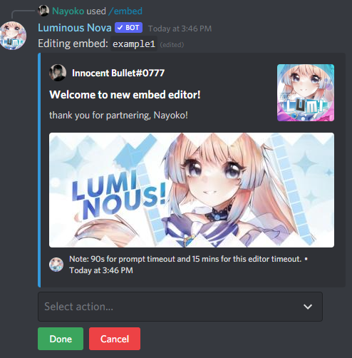

# Customizing your partnership & affiliate responses / How to make an embed

This tutorial will show you how to customize each aspect of Nova's partnership and affiliate replies. Nova supports **slash commands** if it has the permissions to use them. Otherwise, the default prefix is `l?`.

1. First, create an embed. You can create one using `[prefix]embed create EmbedName`. Note that your embed name will be **case-sensitive**.

2. Now that you have your embed created, Nova should automatically bring up a box to edit your new embed. Here is a list of all the editable elements:
> [!NOTE]: The embed editor has an inactivity time limit set by Discord. If you click a dropdown, Discord gives you 90 seconds to send what you want to edit it to.

Element | Accepted value
---|---
`author` | 256 characters string.
`authoricon` | HTTPS-only image URL. Only displayed if author set.
`title` | 256 characters string.
`description` | 2048 characters string.
`thumbnail` | Image URL.
`color` | Valid color name or color hex. Available color names: `Red`, `Green`, `Blue`, `Orange`, `Gold`, `Teal`, `Purple`, `Magenta`, `DarkRed`, `DarkGreen`, `DarkBlue`, `DarkOrange`, `DarkTeal`, `DarkPurple`, `DarkMagenta`, `DarkGrey`, `DarkerGrey`, `LightOrange`, `LightGrey`, `LighterGrey`.
`image` | Image URL.
`footer` | 256 characters string.
`footericon` | HTTPS-only image URL. Only displayed if footer set.
`timestamp` | `Yes` or `No` value.

> [!NOTE]: You can also see a list of elements in the dropdown.

3. So, let's start by editing our description. Click on the dropdown, and select `description`. Now, you need to send a message containing what you want the description to say. For this example, I'll have it say "`thank you for partnering!`". As you can see in the image below, once we send our text, the description updates in real-time.

4. Let's do one more, to give you an example on how to use what are called **variables**. Variables are exactly what the word describes - they change, depending on, well, variables. For example, let's edit the description again. Let's make it say "`thank you for partnering, $(user.nick)!`". What this will do, is replace `$(user.nick)` with the name of whoever posted the partnership/affiliate as shown **here**:

All variables work the same way - you can view all available variables and see a description of what they do [here](../commands/variables.md) or by running `[prefix]topic variables`.

You can see which elements show on the embed via a color-coded guide **here**:

# Telling Nova how to use your customized embed.

Now that you've created your embed, we need to tell Nova to use it.

1. For partnerships, run `[prefix]set replymessage partnersuccess Mentions work in this section! %% EmbedName`.

2. For affiliates, the command is `[prefix]set replymessage affiliatesuccess Mentions also work in this section! %% EmbedName`.

`%% EmbedName` is what tells Nova to attach your embed to the custom reply.

Now, go ahead and post an invite link in your partnership and/or affiliate channel(s). You should see the embed you've created. 

> [!WARNING]
> Do not use your own servers link! By default, Nova is configured for self-link detection. You can use `discord.gg/test` or any other link you see fit.
