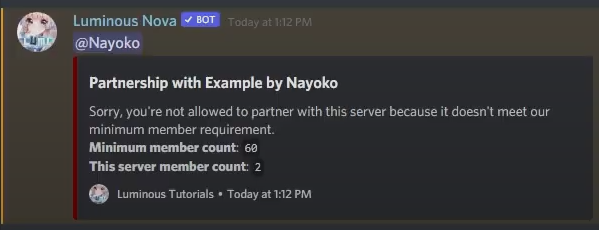
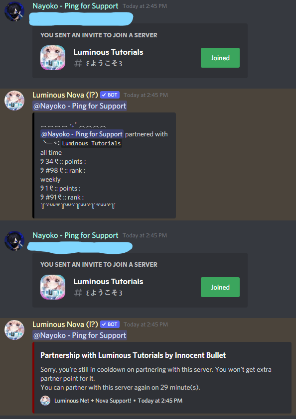

# Setting up partnership requirements
This tutorial will guide you through configuring Nova's highly customizable partnership requirement features - involving a minimum server member requirement, a minimum server age, etc. These are divided into separate sections on this page.
* [Set up a minimum server age requirement]()
* [Set a cooldown before a user can partner with the same server twice]()
* [Configuring what Nova does when certain requirements are not met]()
* [Set up server blacklists]()

## Setting up a minimum server member requirement
#### This section will tell you how to have Nova check if a server has enough members to meet your requirements before considering it a valid partnership or affiliate.
> [!NOTE] When Nova counts how many members a server has, bots won't be counted.

> [!WARNING] The `/` indicates instructions to use **one or the other** in your command, **not both**.

> [!IMPORTANT] Due to Nova caching invite info to avoid ratelimit, member counts for servers won't be updated in real-time.
1. The help page for this command can be viewed using `[prefix]help set memberreq`. You can set separate member requirements for both partnerships and affiliates. By default, Nova does not have any member count requirements active.

2. So for example, let's set a member requirement of 60. We can do that using `[prefix]set memberreq partner`/`affiliate 60`.

3. Now, if a partnership or affiliate is posted with a server below 60 members, by default, Nova will ping them with a message telling them that the server doesn't meet your member requirements. This will also not award them a point for that partnership.

#
## Setting a cooldown requirement to partner with the same server twice
This section will show you how to set a minimum cooldown time a user must wait before partnering with the same server twice.

> [!WARNING] The `/` indicates instructions to use **one or the other** in your command, **not both**.

> [!NOTE] The numbers in our `set cooldown` commands are in **minutes**.

1. So, we can set cooldowns separately between our partnerships and affiliates. The format for the command is `[prefix]set cooldown partner`/`affiliate NumHere`.

2. So, if I run `[prefix]set cooldown partner 30`, partnership managers can not post the same server more than **one time** every **30** minutes:

> [!NOTE] You can turn off cooldown by running `[prefix]set cooldown partner`/`affiliate 0`.

#
## Configuring what Nova does when certain requirements are not met
#### This will walk you through how to configure Nova's behavior when certain conditions are not met. This includes `allow` and `delete` for each setting.

1. First, let's see the help panel by running `[prefix]help set overridebehavior`. Here, we can see the default settings, as well as examples on running our command.

2. So, for example, see how `partnermemreq` is set to `allow`? This means that when a partnership is posted with a server that doesn't meet your member requirements, Nova will not delete the message, but will tell them it doesn't meet the requirements, and not award them a partner point.
