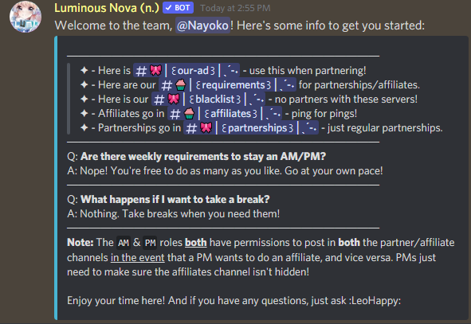

# Making a PM/AM welcome message
#### This will guide you through making fully customizable welcome message for AMs & PMs that greets them. This is useful for pointing them to your blacklist channel, requirements, ad channel, etc.
> [!NOTE] The PM/AM welcome message is automatically posted when you add a PM/AM using Nova's `[prefix]addmanager` command. **(hyperlink here in the future when I write the tutorial for that!)**
1. First, let's create an embed just like we did in our **[custom reply tutorial](https://github.com/Naiyoko/nova-markdown/blob/master/tutorials/custom_reply.md)**. The steps for creating & editing the embed are **exactly the same**.

2. Next, let's create a new PM/AM welcome channel. In the per-channel permission settings, add your **PM** role, your **AM** role, and **Nova**, and then set them up so they have access to that channel.

3. Now, we tell Nova which channel is for PM/AM chats + welcome, using `[prefix]setpmchannel #channel`.

4. Telling Nova to use our customized PM/AM welcome message is pretty similar to setting your partnership/affiliate reply. The format is: `[prefix]setpmwelcomemessage You can put role mentions/variable mentions here %% EmbedName`.

Test out your welcome message by using `[prefix]testreply pmwelcome`. You should see a message like this:

##
***If you have any issues following this tutorial, you can check our [FAQ](../faq.md), or join our [support server](https://discord.gg/cAKmRVrsjR) for help.***