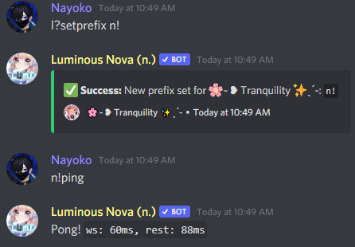

# Changing Nova's prefix

This tutorial will guide you through changing Nova's prefix, and resetting it, as well as a note. This will only take a couple of seconds.

> [!NOTE] 
> You can also ping the bot and use that as a prefix. Example: `@Luminous Nova#4744 help`

1. To change your prefix, it's as simple as running `[prefix]setprefix prefixHere`. So for example, I'll run `[prefix]setprefix n!`, and now all commands use `n!` at the front instead of `l?` as shown below:

2. To reset Nova's prefix back to its default (`l?`), run the `[prefix]setprefix` command, but leave it blank - don't enter a new prefix for Nova to use.

> ***If you have any issues following this tutorial, you can check our [FAQ](../faq.md), or join our [support server](https://discord.gg/cAKmRVrsjR) for help.***